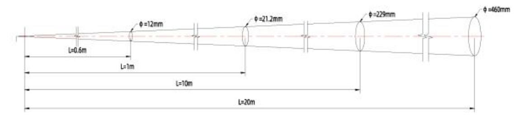
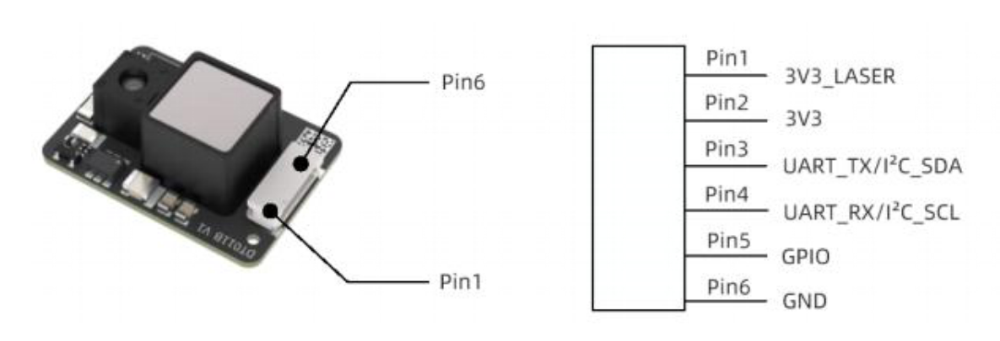
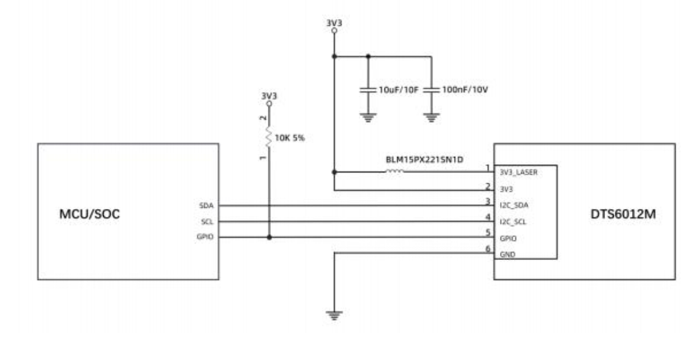

# dts6012m-i2c-esphome
Custom ESPHome component for the DTS6012M time-of-flight distance sensor using its I2C interface.

Most of the code is generated by ChatGPT-4 based on the sensor's datasheet and ESPHome documentation.

Tested with an ESP32 WROOM (denky32) and ESPHome 2025.9.3.

### Distance Cone
From documentation:


## ⚙️ Hardware Requirements


**Sensor:** DTS6012M time-of-flight distance sensor

**Microcontroller:** ESP32 (recommended) or maybe ESP8266?

**Connections:**

- Sensor Pin 1 **VCC → 3.3V_LASER**
- Sensor Pin 2 **VCC → 3.3V**
- Sensor Pin 3 **TX → SDA pin** of ESP32
- Sensor Pin 4 **RX → SCL pin** of ESP32
- Sensor Pin 5 **GPIO5 → 3.3V**
- Sensor Pin 6 **GND → GND**



## Wire for I2C Connection


This library targets only the I2C interface of the DTS6012M sensor. Make sure to connect the sensor accordingly. I had sometimes issues when the pin 5 was not HIGH on startup. I suspect brownout.


## Possible Gotchas
The default I2C address of the DTS6012M sensor is fixed to `0x51`. That is defined in the DTS6012M.h file. Modify, if needed.

# Troubleshooting Problems during Building
Sometimes the build cache becomes corrupted, especially when you messed up with some external components. To fix this, you can clear the build cache by deleting the `.esphome/build` folder:
```shell
rm -rf /config/.esphome/build
```
Then try to build again.