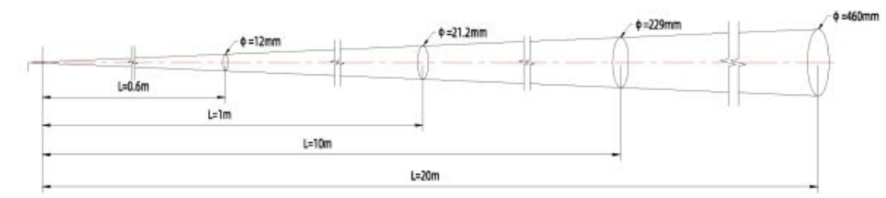
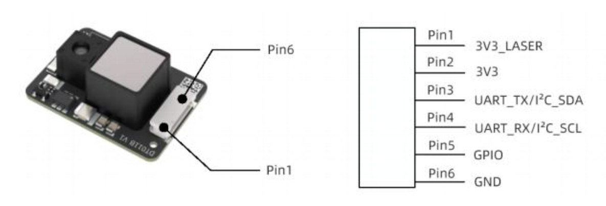
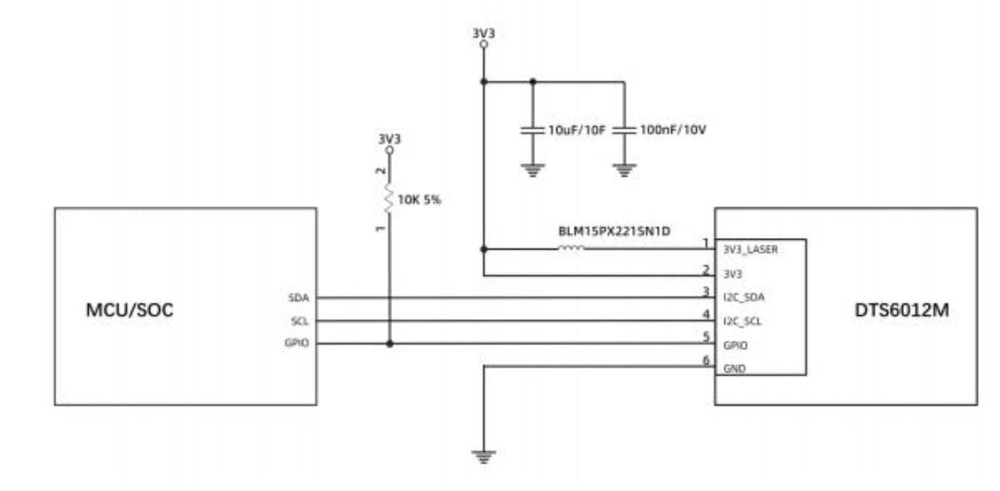

# dts6012m-i2c-esphome
Custom ESPHome component for the DTS6012M time-of-flight distance sensor using its I2C interface.

Most of the code is generated by ChatGPT-4 based on the sensor's datasheet and ESPHome documentation. I didn't bother with so many details, so tread carefully and test thoroughly before using it. This is just a hobby project I bashed by my forehead on the keyboard until I made it work.

Tested with an ESP32 WROOM (denky32) and ESPHome 2025.9.3.

### Distance Cone
From documentation:


## ⚙️ Hardware Requirements


**Sensor:** DTS6012M time-of-flight distance sensor

**Microcontroller:** ESP32 (recommended) or maybe ESP8266?

**Connections:**

- Sensor Pin 1 **VCC → 3.3V_LASER**
- Sensor Pin 2 **VCC → 3.3V**
- Sensor Pin 3 **TX → SDA pin** of ESP32
- Sensor Pin 4 **RX → SCL pin** of ESP32
- Sensor Pin 5 **GPIO5 → 3.3V**
- Sensor Pin 6 **GND → GND**



## Wire for I2C Connection


This library targets only the I2C interface of the DTS6012M sensor. Make sure to connect the sensor accordingly. I had sometimes issues when the pin 5 was not HIGH on startup. I suspect brownout.


## Possible Gotchas
The default I2C address of the DTS6012M sensor is fixed to `0x51`. That is defined in the DTS6012M.h file. Modify, if needed.

# Example ESPHome Configuration
This worked for me. Adjust pins and settings as needed.
```yaml
esphome:
  name: dts6012m-node
  on_boot:
    priority: -100
    then:
      - if:
          condition:
            lambda: return id(prevent_deep_sleep);
          then:
            - deep_sleep.prevent: deep_sleep_control

esp32:
  board: denky32
  framework:
    type: arduino

# Enable logging
logger:
  level: DEBUG

# Enable Home Assistant API
api:
  encryption:
    key: !secret api_encryption_key

ota:
- platform: esphome
  password: !secret ota_password

wifi:
  use_address: 192.168.1.16
  ssid: !secret wifi_ssid
  password: !secret wifi_password
  fast_connect: True

  # Enable fallback hotspot (captive portal) in case wifi connection fails
  ap:
    ssid: "ESP32_Fallback"
    password: !secret wifi_fallback_outside
    # ap_timeout: 1min

i2c:
  sda: 21
  scl: 18
  scan: false
  # optional: lower clock if unstable
  frequency: 10kHz

captive_portal:

globals:
  - id: prevent_deep_sleep
    type: bool
    restore_value: yes
    initial_value: 'false'

external_components:
  - source: github://ronmarti/dts6012m-i2c-esphome@v0.1
    components: [dts6012m]

dts6012m:
  update_interval: 500ms
  retries: 3
  distance:
    name: "DTS6012M Distance"

sensor:

deep_sleep:
  id: deep_sleep_control
  run_duration: 30s
  sleep_duration: 30s

switch:
  - platform: template
    name: "Prevent Deep Sleep"
    id: prevent_deep_sleep_switch
    entity_category: config
    optimistic: true
    lambda: return id(prevent_deep_sleep);
    turn_on_action:
      - globals.set:
          id: prevent_deep_sleep
          value: 'true'
      - deep_sleep.prevent: deep_sleep_control
    turn_off_action:
      - globals.set:
          id: prevent_deep_sleep
          value: 'false'
      - deep_sleep.allow: deep_sleep_control

```

The important part is the `external_components` section, which pulls in the custom DTS6012M component from this repository. Adjust the version tag as needed.

## Periodic Node Deep Sleep
If you want the whole ESP32 node to wake up, measure, report, and then power down for a while, use ESPHome's `deep_sleep` component:

- `run_duration`
  How long the node stays awake after boot. This must be long enough for Wi-Fi connection, API/OTA startup, and one or more sensor updates.
- `sleep_duration`
  How long the node remains in deep sleep before waking again.

Example:

```yaml
deep_sleep:
  run_duration: 10s
  sleep_duration: 30s
```

Practical notes:

- While the node is asleep, it is offline. Home Assistant will not be able to poll it.
- OTA updates only work during the `run_duration` wake window.
- Your `dts6012m.update_interval` should be shorter than `run_duration`, otherwise the node may go back to sleep before publishing a measurement.
- For battery-powered operation, deep sleep at the node level is usually much more effective than only trying to idle the sensor.
- The `Prevent Deep Sleep` switch is exposed to Home Assistant and, when turned on, keeps the node awake until you turn it off again.
- The switch state is restored after reboot, so if you enabled it for maintenance or debugging, the node will remain awake on the next boot too.
- A `run_duration` of `10s` can be too short once Wi-Fi association and encrypted API authentication are included. `30s` is a safer starting point.
- Home Assistant normally keeps the ESPHome API connection open while the node is awake, so API connectivity should not be used as the condition for blocking deep sleep. Only the explicit `Prevent Deep Sleep` switch does that here.

## Power Saving Behavior
By default, the component keeps the sensor in continuous ranging mode because it is the most reliable configuration for fresh measurements.

In continuous mode, the component also re-sends the start command at each update cycle to prevent stale latched readings on sensor variants that require re-arming.

Optional low-power settings are available:

- `sleep_between_updates: true`
  Uses the sensor's internal standby by stopping the laser between updates and starting it again before the next read.
- `wakeup_time: 20ms`
  Delay after leaving standby before the sensor is read.
- `power_pin:`
  Recommended for battery-powered builds. Use a GPIO-controlled transistor or MOSFET to switch the sensor's `3V3_LASER` supply.
- `powerup_time: 250ms`
  Delay after turning the hardware power pin on before initializing and reading the sensor.

Example low-power configuration:

```yaml
dts6012m:
  update_interval: 5s
  retries: 3
  power_pin:
    number: GPIO23
  powerup_time: 250ms
  wakeup_time: 20ms
  distance:
    name: "DTS6012M Distance"
```

If you enable `sleep_between_updates` without a hardware `power_pin`, some sensor variants may continue returning a stale latched measurement after wake-up. If that happens, use continuous mode or hardware power gating instead.

# Development in Container: Docker Compose
For development purposes, you can use the following `docker-compose.yaml` to set up an ESPHome environment with access to USB devices for flashing and monitoring your ESP32 boards.

For `secrets.yaml`, create a file in the project-root directory with your WiFi and OTA credentials, it will be mounted into the container.

Example of `secrets.yaml`:
```yaml
wifi_ssid: "my_wifi_ssid"
wifi_password: "my_wifi_password1234567"
```

## Tips for Deploying Config to Device
Use Chromium-based browser (Edge, Chrome, Brave, etc.) to access the ESPHome dashboard at `http://localhost:6052` (adjust port as needed). Chromium have serial monitoring built-in, I suppose that's why it is needed for the first flash. Then you can use any browser for OTA updates.

For the first upload wiht wifi credentials to enable the OTA updates, you need to connect the ESP32 via USB to your computer and select the appropriate serial port in the ESPHome dashboard. If you have issues with accessing the serial port from within the container, you can bypass by downloading the compiled binary from the container's ESPHome dashboard (Install > Manual Download > Factory Format > Open ESPHome Web) and flashing it using online-loaded esphome dashboard.

## Troubleshooting Problems during Building
Sometimes the local build cache becomes corrupted, especially when you messed up with some external components. To fix this, you can clear the build cache by deleting the `.esphome/build` folder:
```shell
rm -rf /config/.esphome/build
```
Then try to build again.

Sometimes, esphome downloads and cache the external components and until version is changed, it won't download again. To force re-download of the external components, you can delete the `.esphome/downloads` folder:
```shell
rm -rf /config/.esphome/external_components
```
Then try to build again.